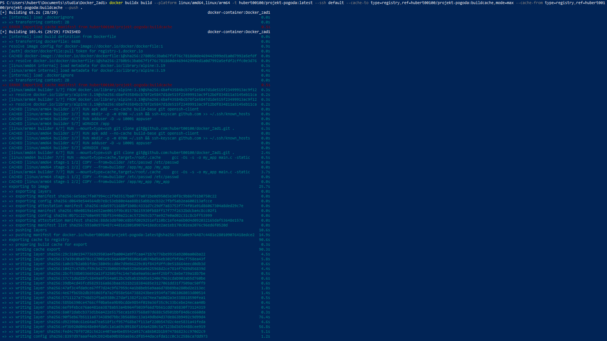
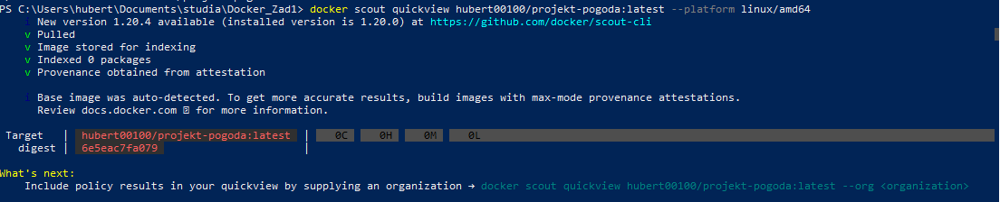

Komenda budująca:

docker buildx build --platform linux/amd64,linux/arm64 `
  -t hubert00100/projekt-pogoda:latest `
  --ssh default `
  --cache-to type=registry,ref=hubert00100/projekt-pogoda:buildcache,mode=max `
  --cache-from type=registry,ref=hubert00100/projekt-pogoda:buildcache `
  --push .

Dedykowany Builder: W nagłówku logów widnieje docker-container:Docker_zad1. 
Potwierdza to użycie własnego buildera opartego na sterowniku docker-container, co jest niezbędne do budowy wieloplatformowej.

Pobieranie źródeł przez SSH: Linie oznaczone jako [builder 6/7] RUN --mount=type=ssh git clone... 
potwierdzają, że proces budowania pomyślnie wykorzystał zamontowany agent SSH do bezpiecznego pobrania kodu z repozytorium GitHub.

Budowa Wieloplatformowa (Multi-arch): W logach widoczne są równoległe procesy dla architektur linux/amd64 oraz linux/arm64. 
Zakończyły się one utworzeniem wspólnej listy manifestów (manifest list).

Zarządzanie Cache (Registry & Max Mode): * Status CACHED przy wielu krokach informuje o poprawnym odczycie warstw z pamięci podręcznej.

Sekcja exporting cache to registry na końcu logu potwierdza, że kompletne dane cache (tryb max) 
zostały przesłane do zewnętrznego rejestru na Docker Hub pod tagiem buildcache.

Wynik skanowania potwierdza całkowity brak podatności, co udało się osiągnąć dzięki wykorzystaniu minimalistycznego obrazu bazowego typu scratch, pozbawionego zbędnych bibliotek i narzędzi systemowych. Bezpieczeństwo dodatkowo wzmacnia statyczna kompilacja aplikacji w języku C, która sprawia, że kontener zawiera wyłącznie niezbędny plik binarny, eliminując tym samym potencjalne drogi ataku.

Linki:

GitHub: 

https://github.com/hubert00100/docker_zad1

DockerHub: 

https://hub.docker.com/r/hubert00100/projekt-pogoda
